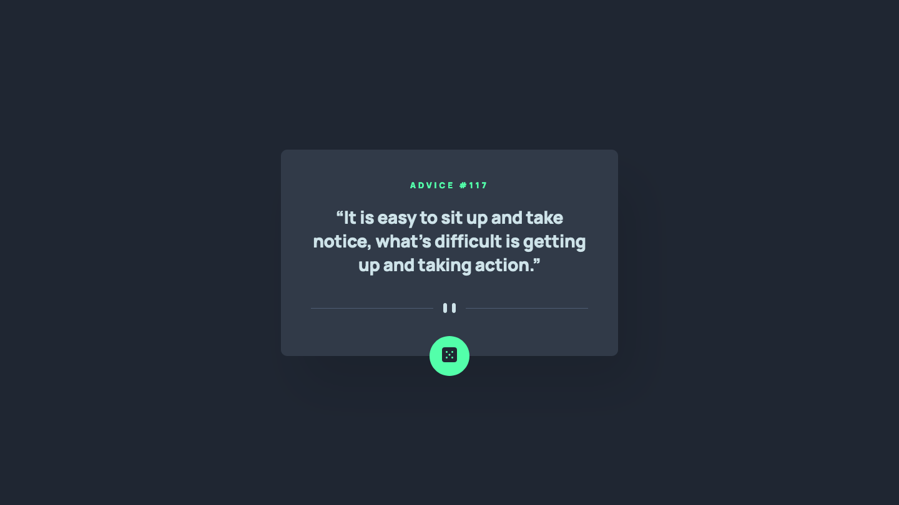

# Advice generator app solution

This is a solution to the [Advice generator app challenge on Frontend Mentor](https://www.frontendmentor.io/challenges/advice-generator-app-QdUG-13db).

## Table of contents

-   [Screenshot](#screenshot)
-   [Links](#links)
-   [Built with](#built-with)
-   [Author](#author)

## Screenshot

## Links

-   [Solution URL](https://github.com/ionStici/advice-generator-app-main)
-   [Live Site URL](https://ionstici.github.io/advice-generator-app-main)

## Built with

-   Semantic HTML5 markup
-   Mobile-first workflow
-   APIs

## Author

-   [GitHub](https://github.com/ionStici)
-   [Frontend Mentor](https://www.frontendmentor.io/profile/ionStici)
-   [Twitter](https://twitter.com/ionStici_)

<!-- ### Primary

-   Light Cyan: hsl(193, 38%, 86%)
-   Neon Green: hsl(150, 100%, 66%)

### Neutral

-   Grayish Blue: hsl(217, 19%, 38%)
-   Dark Grayish Blue: hsl(217, 19%, 24%)
-   Dark Blue: hsl(218, 23%, 16%)

### Body Copy

-   Font size (quote): 28px

### Font

-   Family: [Manrope](https://fonts.google.com/specimen/Manrope)
-   Weights: 800 -->
